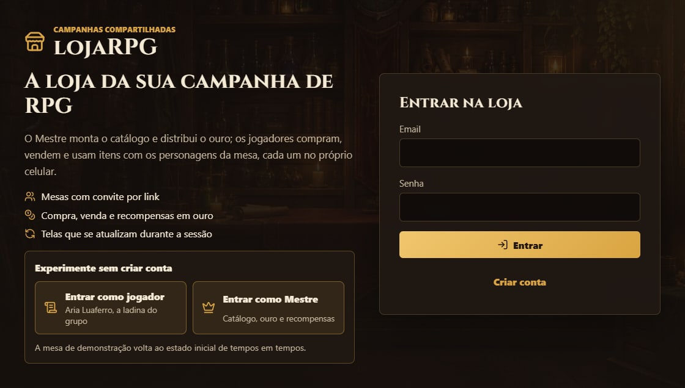
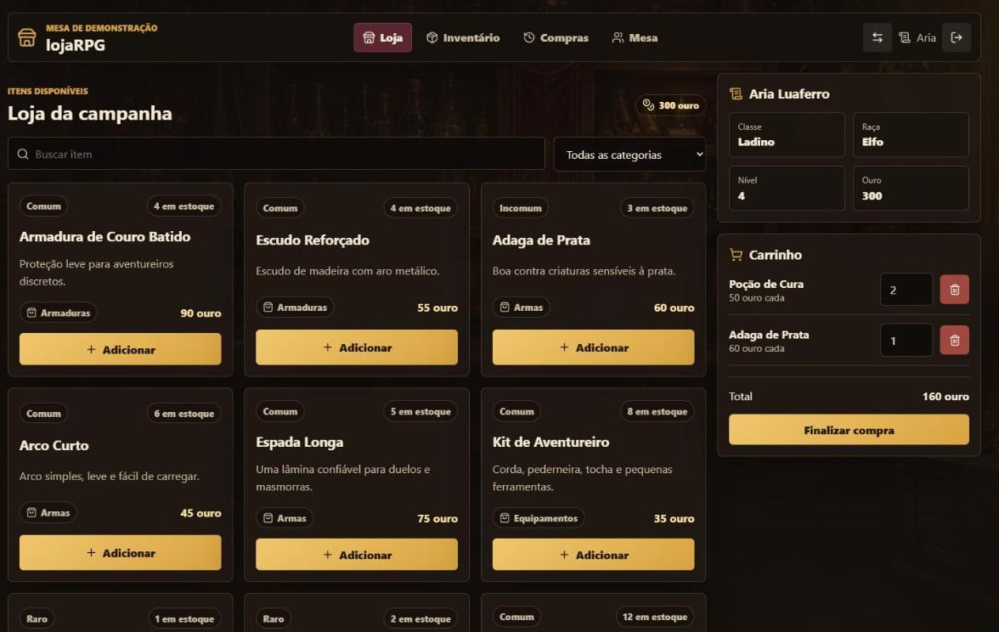
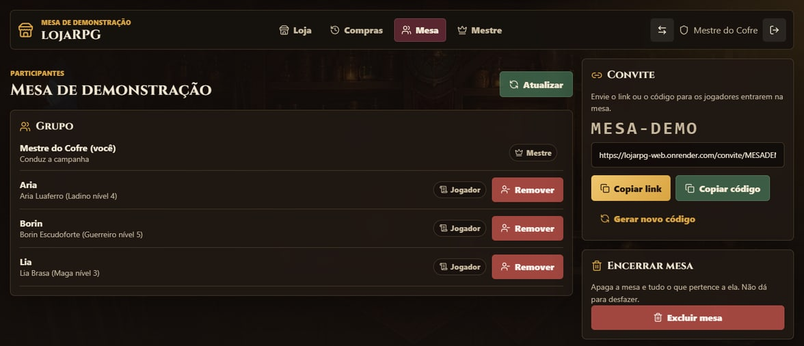
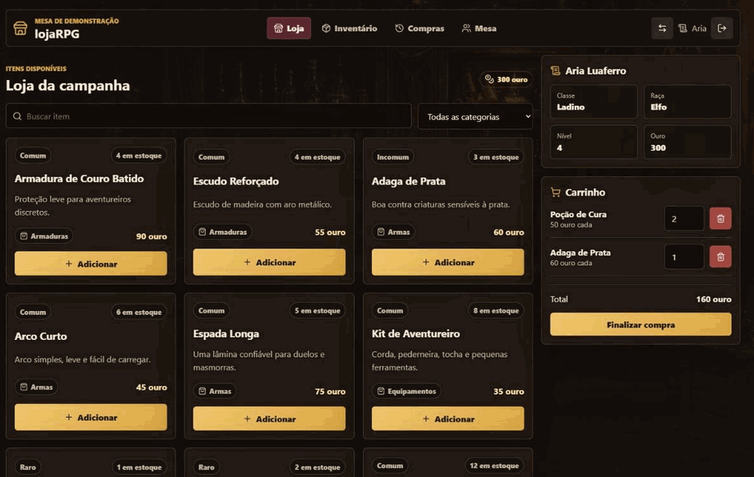
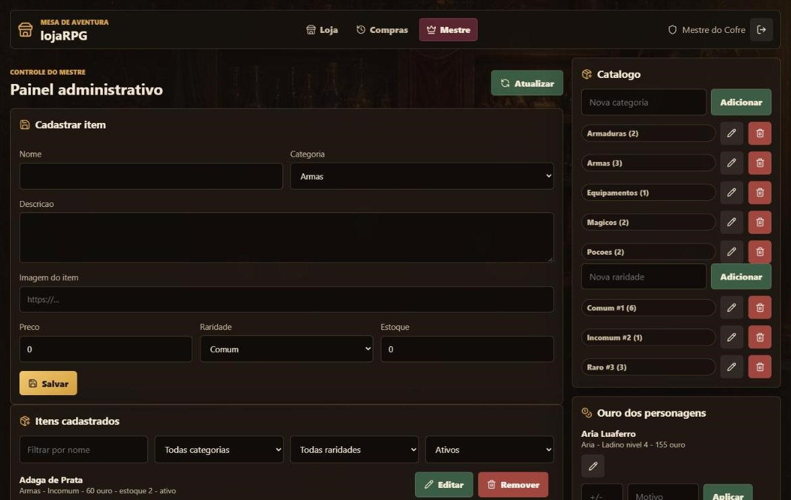
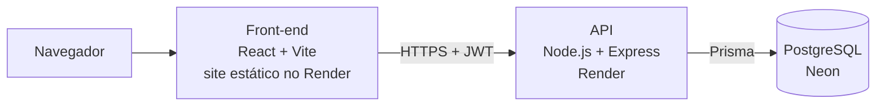

# lojaRPG

[](https://github.com/PedroBartkevihi/lojaRPG/actions/workflows/ci.yml)

Loja virtual para campanhas de RPG de mesa. Cada grupo tem sua mesa: quem
cria a mesa é o Mestre e convida os jogadores por link ou código. O Mestre
administra itens, categorias, raridades, estoque e o ouro dos personagens; os
jogadores criam personagens na mesa, montam o carrinho e compram com o ouro
deles. Catálogo, inventário e histórico de compras são separados por mesa.

**Demonstração online:** <https://lojarpg-web.onrender.com>

Na tela de entrada, os botões **Entrar como jogador** e **Entrar como Mestre**
abrem a mesa de demonstração sem digitar senha. As contas são estas:

| Perfil | Email | Senha |
| --- | --- | --- |
| Jogador | aria@lojarpg.local | jogador123 |
| Mestre | mestre@lojarpg.local | mestre123 |

Essas contas participam da **Mesa de demonstração**, que volta ao estado
inicial sempre que a API reinicia, então pode testar à vontade. Para testar o
convite, crie sua própria conta e entre na mesa com o código `MESA-DEMO`, ou
crie uma mesa e convide alguém. Mesas criadas por outras contas não são
apagadas no reset.

A demonstração roda no plano gratuito do Render: depois de 15 minutos sem
acesso, a API leva cerca de 1 minuto para acordar. Enquanto isso, a tela mostra
blocos de carregamento e avisa que a API está acordando.





## Funcionalidades

**Mesas**

- Qualquer conta cria uma mesa e é o Mestre dela; a mesma conta pode ser
  jogador em outras mesas.
- Convite por link ou código. O Mestre gera um código novo para invalidar o
  anterior e remove jogadores.
- Cada mesa tem catálogo, personagens, compras e históricos próprios, e começa
  com um catálogo de exemplo que o Mestre edita.
- Quem sai ou é removido da mesa mantém os personagens e os recupera ao
  entrar de novo.
- As telas se atualizam sozinhas durante a sessão: o ouro que o Mestre dá ou
  o item que outro jogador compra aparecem sem recarregar a página.

Para jogar com o seu grupo: crie uma conta, crie a mesa e envie o link da aba
**Mesa** aos jogadores. Cada um cria a conta pelo link, entra na mesa e cria o
personagem.



**Jogador**

- Um ou mais personagens por mesa (botão "Novo personagem"), com a escolha
  do personagem ativo.
- Catálogo com busca (que ignora acentos) e filtro por categoria; cada item
  tem a cor da raridade (comum, incomum, raro, muito raro, lendário) e um ícone
  pela categoria.
- Carrinho e compra com o ouro do personagem ativo; no celular, uma barra no
  rodapé leva ao carrinho.
- Venda de itens à loja pela regra do D&D 5e (metade do preço) ou pelo valor
  que o Mestre definir; o item volta ao estoque.
- Uso de itens consumíveis, como poções, que saem do inventário.
- Inventário, histórico de compras e de vendas, usos e recompensas por
  personagem.



**Mestre**

- Painel em abas: grupo e ouro, itens, catálogo e históricos.
- Cadastro, edição, remoção e reativação de itens.
- Categorias e raridades próprias, com a cor de cada raridade escolhida pelo
  Mestre; ao remover uma em uso, os itens são realocados.
- Recompensas: ouro dividido entre o grupo (avisando o que sobra da divisão)
  ou o mesmo valor para cada um, e itens entregues direto no inventário,
  inclusive itens que não estão à venda.
- Preço de venda por item e itens que a loja não compra, como itens de missão.
- Ajuste de ouro com motivo obrigatório e auditoria de cada alteração.
- Histórico de movimentações de estoque.



## Arquitetura



Na API, cada requisição passa por `routes` → `controllers` (validação com Zod)
→ `services` (regras e transações) → `models` (consultas pelo Prisma). As
rotas da loja ficam abaixo de `/campaigns/:id`, e um middleware confere se quem
pede participa da mesa e qual é o papel dele nela.

## Decisões técnicas

- **Mesas isoladas.** Toda consulta de itens, catálogo, personagens, compras e
  auditoria filtra pela mesa da URL. Quem não participa recebe 404, como se a
  mesa não existisse, e um id de outra mesa (item, personagem, categoria) é
  tratado como inexistente. Testes tentam ler e alterar dados entre mesas.
- **O papel é da mesa, não da conta.** Não existe mais chave de cadastro de
  Mestre: quem cria a mesa é o Mestre dela. Os códigos de convite usam um
  alfabeto sem caracteres ambíguos (0/O, 1/I), e as tentativas de entrar têm
  rate limit.
- **Demonstração e mesas reais no mesmo banco.** O reset da demonstração apaga
  só a mesa `MESA-DEMO`, as contas de exemplo e as mesas criadas por elas.
- **Compras e vendas simultâneas sem perder dinheiro nem estoque.** O desconto
  de ouro e de estoque é um update condicional ("só desconta se ainda houver
  saldo"), a venda só paga depois de tirar o item do inventário do mesmo
  jeito, e as edições do Mestre rodam em transação e só gravam se o valor lido
  não mudou (senão respondem 409). Testes disparam compras, vendas e ajustes ao
  mesmo tempo para garantir isso.
- **Regras de integridade no próprio banco.** As migrations têm restrições
  `CHECK` (ouro e estoque nunca negativos, nível de 1 a 20), que valem mesmo
  para código que grave direto no banco.
- **Validação de entrada com Zod**, com schemas por domínio em
  `backend/src/schemas`.
- **Autenticação** com access token curto, refresh token com rotação e
  revogação, rate limit nas rotas de autenticação e Helmet. Atrás do proxy do
  Render, o rate limit usa o IP de cada usuário (`TRUST_PROXY`), e não o do
  proxy, que todos compartilhariam.
- **Atualização por consulta periódica, não por WebSocket.** Com a aba
  visível, o front recarrega os dados a cada 10 segundos; aba escondida não faz
  requisições. Para quatro pessoas numa mesa isso basta, e funciona no plano
  gratuito do Render, que dorme e derrubaria conexões abertas.
- **Primeira impressão no plano gratuito.** Enquanto a API acorda, a tela
  mostra blocos no formato do conteúdo e, depois de 4 segundos, explica a
  demora, em vez de parecer travada.
- **Segredo verificado na inicialização:** em produção, a API não sobe com um
  `JWT_SECRET` curto ou igual aos exemplos do repositório.
- **CI no GitHub Actions** a cada push: lint (ESLint) e testes do back-end
  com PostgreSQL; lint, testes e build do front-end.

## Stack

- Front-end: React, Vite e React Router.
- Back-end: Node.js, Express, Zod, JWT (access + refresh token).
- Banco: PostgreSQL com Prisma e migrations versionadas.
- Testes e qualidade: Vitest, Supertest, Testing Library e ESLint.
- Infra: Docker Compose, GitHub Actions, Render e Neon.

## Como rodar localmente

Pré-requisitos: Node.js 24 e Docker.

```bash
# Banco (na raiz do projeto)
docker compose up -d db

# API
cd backend
npm install
cp .env.example .env
npx prisma generate
npm run db:reset
npm run dev

# Front-end (em outro terminal)
cd frontend
npm install
cp .env.example .env
npm run dev
```

No Prompt de Comando do Windows, troque `cp` por `copy`; no PowerShell e no
Git Bash, `cp` funciona.

- Front-end: <http://localhost:5173>
- API: <http://localhost:3001>

O container do banco cria o `lojarpg` (desenvolvimento) e o `lojarpg_test`
(testes). Os usuários de exemplo são os da tabela acima, mais os jogadores
`borin@lojarpg.local` e `lia@lojarpg.local` (senha `jogador123`).

Scripts do diretório `backend`:

- `npm run db:init`: aplica as migrations pendentes.
- `npm run db:seed`: recria a mesa de demonstração e as contas de exemplo de
  `prisma/seed.js`, sem tocar nas outras mesas.
- `npm run db:reset`: apaga o banco local, reaplica as migrations e roda o
  seed.

## Testes

```bash
cd backend
npm run lint
npm test

cd frontend
npm run lint
npm test
```

Os 49 testes do back-end usam o banco `lojarpg_test` do Docker: aplicam as
mesmas migrations do desenvolvimento e recriam os dados antes de cada teste.
Por segurança, só rodam em bancos cujo nome termina em `_test`. Eles cobrem
mesas, convites e isolamento entre mesas, autenticação e permissões, CRUD de
itens e catálogo, compras, vendas, uso de itens e recompensas, compras, vendas
e ajustes simultâneos,
validação das entradas, regras `CHECK` do banco, o reset da demonstração e a
verificação dos segredos de produção.

## Rotas da API

Autenticação:

- `POST /auth/register`
- `POST /auth/login`
- `POST /auth/refresh`
- `POST /auth/logout`
- `GET /auth/me`

Mesas:

- `GET /campaigns`: mesas do usuário, com o papel em cada uma
- `POST /campaigns`: cria a mesa (quem cria é o Mestre)
- `POST /campaigns/join`: entra com `inviteCode`
- `GET /campaigns/:id`: mesa e participantes
- `POST /campaigns/:id/invite-code` (Mestre): gera um código novo
- `DELETE /campaigns/:id/members/:userId`: o Mestre remove um jogador; o
  jogador usa o próprio id para sair
- `DELETE /campaigns/:id` (Mestre)

As rotas abaixo ficam dentro da mesa, em `/campaigns/:id`, e "Mestre" é o
Mestre daquela mesa.

Catálogo e itens:

- `GET /items`
- `POST /items`, `PUT /items/:id`, `DELETE /items/:id` e
  `PATCH /items/:id/reactivate` (Mestre)
- `GET /catalog/categories` e `GET /catalog/rarities`
- `POST|PUT|DELETE /catalog/categories` e `/catalog/rarities` (Mestre)
- `GET /catalog/stock-movements` (Mestre)

Personagens:

- `GET /characters` (Mestre)
- `GET /characters/me`
- `POST /characters`
- `PUT /characters/:id`
- `PATCH /characters/:id/gold` (Mestre, com `reason`)
- `GET /characters/gold-audit` (Mestre)

Compras e inventário:

- `POST /purchases`
- `GET /purchases/me?characterId=ID`
- `GET /purchases` (Mestre)
- `GET /inventory/me?characterId=ID`: itens e histórico do personagem
- `GET /inventory/:characterId`
- `POST /inventory/:characterId/sell` e `POST /inventory/:characterId/use`
  (dono do personagem, com `itemId` e `quantity`)
- `GET /inventory/logs` (Mestre): vendas, usos e recompensas da mesa

Recompensas (Mestre):

- `POST /rewards/gold`: `characterIds`, `total`, `mode` (`split` divide,
  `each` dá o valor a cada um) e `reason`
- `POST /rewards/items`: `characterId`, `itemId`, `quantity` e `reason`

## Estrutura

```text
lojaRPG/
  backend/
    prisma/        schema, migrations e seed
    src/
      routes/      rotas Express
      controllers/ entrada e saída HTTP
      data/        catálogo inicial das mesas novas
      schemas/     validação com Zod
      services/    regras de negócio e transações
      models/      consultas pelo Prisma
      middlewares/ autenticação, mesa e papel, erros e rate limit
    tests/
  frontend/
    src/
      pages/       telas (loja, mesas, painel do Mestre...)
      components/  cards, painéis e as abas do painel do Mestre (admin/)
      js/          cliente da API e hooks
  docker/          inicialização do PostgreSQL local
  docs/images/     capturas de tela
  .github/         workflow de CI
  render.yaml      deploy no Render
  DEPLOY.md
```

## Deploy

O [DEPLOY.md](./DEPLOY.md) explica o deploy no Render com Neon, a produção
local com Docker, as variáveis de ambiente e o backup do banco.

## Licença

[MIT](./LICENSE).
