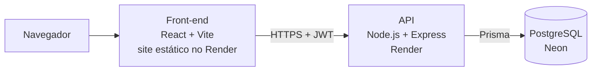

# lojaRPG

[](https://github.com/PedroBartkevihi/lojaRPG/actions/workflows/ci.yml)

Loja virtual para campanhas de RPG de mesa. O Mestre administra itens,
categorias, raridades, estoque e o ouro dos personagens; os jogadores escolhem
um personagem, montam o carrinho e compram com o ouro dele. Inventário e
histórico de compras ficam separados por personagem.

**Demonstração online:** <https://lojarpg-web.onrender.com>

| Perfil | Email | Senha |
| --- | --- | --- |
| Jogador | aria@lojarpg.local | jogador123 |
| Mestre | mestre@lojarpg.local | mestre123 |

A demonstração roda no plano gratuito do Render: depois de 15 minutos sem
acesso, a API leva cerca de 1 minuto para acordar. Os dados voltam ao estado
inicial sempre que ela reinicia, então pode testar à vontade.


## Funcionalidades

**Jogador**

- Cadastro com personagem e vários personagens por conta.
- Catálogo com busca e filtro por categoria.
- Carrinho e compra com o ouro do personagem ativo.
- Inventário e histórico de compras por personagem.

**Mestre**

- Cadastro, edição, remoção e reativação de itens.
- Categorias e raridades próprias; ao remover uma em uso, os itens são
  realocados.
- Ajuste de ouro com motivo obrigatório e auditoria de cada alteração.
- Histórico de movimentações de estoque.


## Arquitetura



Na API, cada requisição passa por `routes` → `controllers` (validação com Zod)
→ `services` (regras e transações) → `models` (consultas pelo Prisma).

## Decisões técnicas

- **Compras simultâneas sem perder dinheiro nem estoque.** O desconto de ouro
  e de estoque é um update condicional ("só desconta se ainda houver saldo"),
  e as edições do Mestre rodam em transação e só gravam se o valor lido não
  mudou (senão respondem 409). Testes disparam compras e ajustes ao mesmo
  tempo para garantir isso.
- **Regras de integridade no próprio banco.** As migrations têm restrições
  `CHECK` (ouro e estoque nunca negativos, nível de 1 a 20), que valem mesmo
  para código que grave direto no banco.
- **Validação de entrada com Zod**, com schemas por domínio em
  `backend/src/schemas`.
- **Autenticação** com access token curto, refresh token com rotação e
  revogação, rate limit nas rotas de autenticação e Helmet.
- **Segredos verificados na inicialização:** em produção, a API não sobe com
  `JWT_SECRET` ou `MASTER_REGISTRATION_KEY` curtos ou iguais aos exemplos do
  repositório.
- **CI no GitHub Actions** a cada push: testes do back-end com PostgreSQL e
  testes e build do front-end.

## Stack

- Front-end: React, Vite e React Router.
- Back-end: Node.js, Express, Zod, JWT (access + refresh token).
- Banco: PostgreSQL com Prisma e migrations versionadas.
- Testes: Vitest, Supertest e Testing Library.
- Infra: Docker Compose, GitHub Actions, Render e Neon.

## Como rodar localmente

Pré-requisitos: Node.js 24 e Docker.

```bash
# Banco (na raiz do projeto)
docker compose up -d db

# API
cd backend
npm install
cp .env.example .env
npx prisma generate
npm run db:reset
npm run dev

# Front-end (em outro terminal)
cd frontend
npm install
cp .env.example .env
npm run dev
```

No Prompt de Comando do Windows, troque `cp` por `copy`; no PowerShell e no
Git Bash, `cp` funciona.

- Front-end: <http://localhost:5173>
- API: <http://localhost:3001>

O container do banco cria o `lojarpg` (desenvolvimento) e o `lojarpg_test`
(testes). Os usuários de exemplo são os da tabela acima, mais os jogadores
`borin@lojarpg.local` e `lia@lojarpg.local` (senha `jogador123`).

Scripts do diretório `backend`:

- `npm run db:init`: aplica as migrations pendentes.
- `npm run db:seed`: recria os dados de exemplo de `prisma/seed.js`.
- `npm run db:reset`: apaga o banco local, reaplica as migrations e roda o
  seed.

## Testes

```bash
cd backend
npm test

cd frontend
npm test
```

Os 32 testes do back-end usam o banco `lojarpg_test` do Docker: aplicam as
mesmas migrations do desenvolvimento e recriam os dados antes de cada teste.
Por segurança, só rodam em bancos cujo nome termina em `_test`. Eles cobrem
autenticação e permissões, CRUD de itens e catálogo, compras e inventário,
compras e ajustes simultâneos, validação das entradas, regras `CHECK` do banco
e a verificação dos segredos de produção.

## Rotas da API

Autenticação:

- `POST /auth/register`
- `POST /auth/login`
- `POST /auth/refresh`
- `POST /auth/logout`
- `GET /auth/me`

Catálogo e itens:

- `GET /items`
- `POST /items`, `PUT /items/:id`, `DELETE /items/:id` e
  `PATCH /items/:id/reactivate` (Mestre)
- `GET /catalog/categories` e `GET /catalog/rarities`
- `POST|PUT|DELETE /catalog/categories` e `/catalog/rarities` (Mestre)
- `GET /catalog/stock-movements` (Mestre)

Personagens:

- `GET /characters` (Mestre)
- `GET /characters/me`
- `POST /characters`
- `PUT /characters/:id`
- `PATCH /characters/:id/gold` (Mestre, com `reason`)
- `GET /characters/gold-audit` (Mestre)

Compras e inventário:

- `POST /purchases`
- `GET /purchases/me?characterId=ID`
- `GET /purchases` (Mestre)
- `GET /inventory/me?characterId=ID`
- `GET /inventory/:characterId`

## Estrutura

```text
lojaRPG/
  backend/
    prisma/        schema, migrations e seed
    src/
      routes/      rotas Express
      controllers/ entrada e saída HTTP
      schemas/     validação com Zod
      services/    regras de negócio e transações
      models/      consultas pelo Prisma
      middlewares/ autenticação, permissões, erros e rate limit
    tests/
  frontend/
    src/           páginas, componentes e chamadas à API
  docker/          inicialização do PostgreSQL local
  docs/images/     capturas de tela
  .github/         workflow de CI
  render.yaml      deploy no Render
  DEPLOY.md
```

## Deploy

O [DEPLOY.md](./DEPLOY.md) explica o deploy no Render com Neon, a produção
local com Docker, as variáveis de ambiente e o backup do banco.
